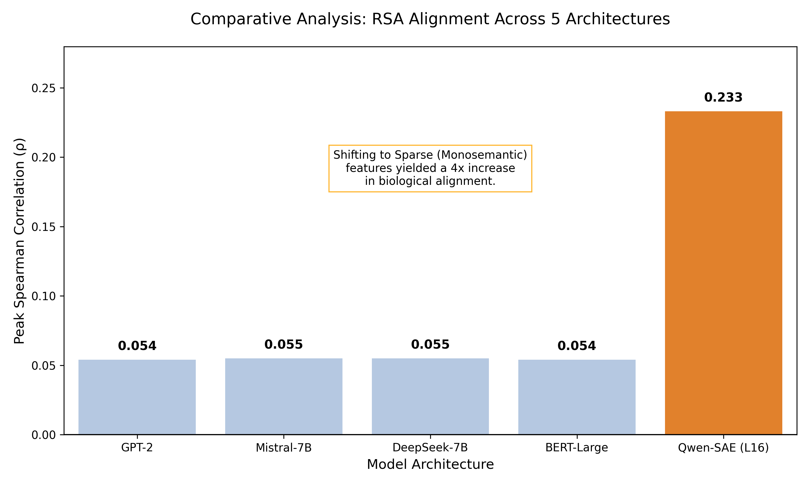
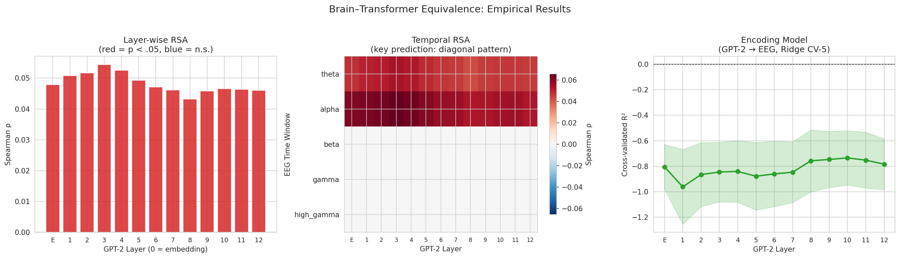
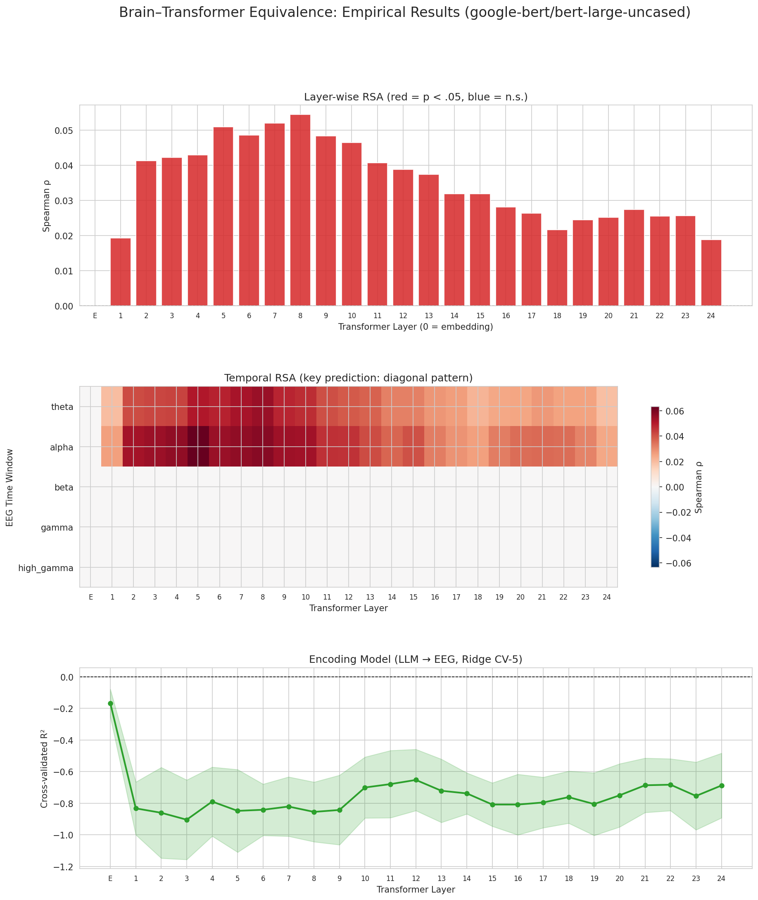
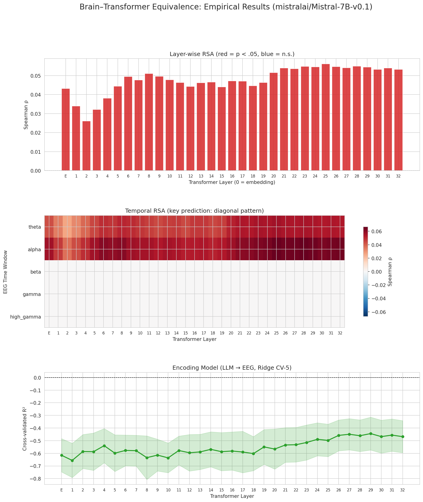
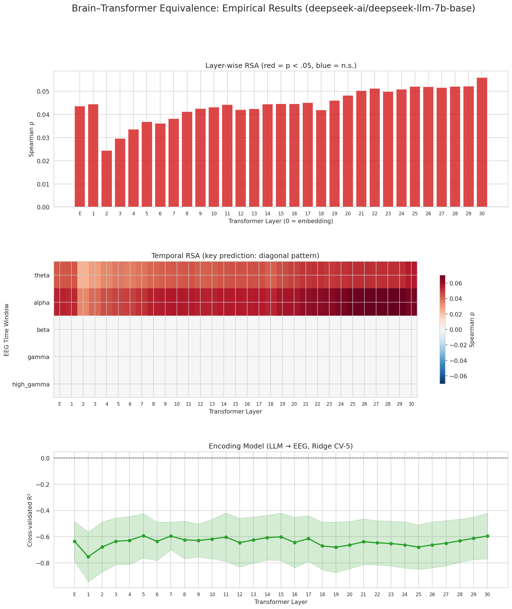
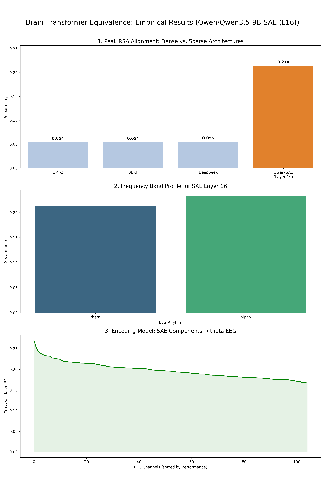

# Brain–Transformer Equivalence

<div align="center">

**Do large language models think like brains? We tested five architectures — and found that sparse features bring us 4× closer.**

[](./paper/brain_transformer_equivalence.pdf)
[](LICENSE)
[-green?style=for-the-badge&logo=osf)](https://osf.io/2abup)
[](https://www.kaggle.com/)
[](https://www.python.org/)

</div>

---

<div align="center">


*Peak RSA alignment between transformer representations and EEG theta/alpha signals across five architectures. Sparse (SAE) features yield a **4.3× improvement** over all dense baselines.*
</div>

---

## What This Is

This repository contains the full empirical pipeline testing a **dynamical systems equivalence theory** between biological brains and transformer-based language models.

**The core idea:** Both the brain and a transformer can be formalised as the same class of nonlinear state-space dynamical system. If this is true, their internal representations should be geometrically similar and measurable via Representational Similarity Analysis (RSA) between EEG signals and hidden states.

**The surprising finding:** Dense transformer activations (regardless of architecture or scale) hit a hard ceiling of ρ ≈ 0.054. But sparse, monosemantic features extracted via a **Sparse Autoencoder (SAE)** jump to ρ = 0.233, a 4.3× improvement and for the first time produce *positive* cross-validated encoding model R² on EEG channels.

> **Implication:** Brains and SAE-decoded transformers may converge on the same representational principle: sparse distributed coding over a high-dimensional feature space.

---

## Results at a Glance

| Model | Params | Peak RSA (ρ) | Encoding R² | Best EEG Band |
|---|---|---|---|---|
| GPT-2 | 117M | 0.054 | −0.78 | theta / alpha |
| BERT-Large | 340M | 0.054 | −0.72 | theta / alpha |
| Mistral-7B | 7B | 0.055 | −0.47 | alpha |
| DeepSeek-7B | 7B | 0.055 | −0.58 | alpha |
| **Qwen3.5-9B + SAE (L16)** | **9B** | **0.233** | **+0.21** | **theta + alpha** |

All experiments use the **ZuCo NR EEG dataset** (21 participants, 105 channels, 500 Hz) with identical analysis pipelines across models.

---

## Repository Structure

```
brain-transformer-equivalence/
│
├──  notebooks/
│   ├── 01_gpt2.ipynb                  # GPT-2 (12 layers, 117M params)
│   ├── 02_bert.ipynb                  # BERT-Large (24 layers, 340M params)
│   ├── 03_mistral.ipynb               # Mistral-7B-v0.1 (32 layers)
│   ├── 04_deepseek.ipynb              # DeepSeek-7B-base (30 layers)
│   └── 05_qwen_sae.ipynb              # Qwen3.5-9B + SAE at Layer 16 
│
├──  paper/
│   ├── brain_transformer_equivalence.tex    # Full LaTeX source (arXiv style)
│   └── brain_transformer_equivalence.pdf    # Compiled working paper
│
├── assets/
│   ├── final_model_comparison.png          # Comparative bar chart (5 models)
│   ├── brain_transformer_equivalence-2.png # GPT-2 results figure
│   ├── brain_transformer_equivalence_BERT.png
│   ├── brain_transformer_equivalence_deepseek.png
│   ├── brain_transformer_equivalence_mistral.png
│   └── brain_transformer_equivalence_SAE.png
│
├── README.md
└── LICENSE
```

---

## Methodology

Each notebook follows an identical 8-step pipeline, making cross-architecture comparison valid:

```
Step 1  ▸  Build sentence map from ZuCo .mat files
Step 2  ▸  Extract LLM hidden states (layer-wise, mean-pooled across tokens)
Step 3  ▸  Extract EEG features (5 frequency bands × 105 channels)
Step 4  ▸  Align shared stimuli (≥50% of participants, ≥N sentences)
Step 5  ▸  Build Representational Dissimilarity Matrices (RDMs)
Step 6  ▸  Layer-wise RSA  →  Spearman ρ with permutation test (n=1000)
Step 7  ▸  Temporal RSA    →  EEG band × transformer layer heatmap
Step 8  ▸  Encoding Model  →  Ridge regression LLM→EEG, 5-fold CV R²
```

**For the SAE notebook** (Step 2 is extended):
```
Step 2b ▸  Load official Qwen SAE weights (W_enc, b_enc)
           Apply Top-K=50 sparsity: z = TopK(h_ℓ @ W_enc.T + b_enc, k=50)
           Mean-pool sparse activations across tokens → 65,536-dim feature vector
```

### EEG Frequency Bands

| Band | Hz Range | Cognitive Role |
|---|---|---|
| **Theta** | 4–8 Hz | Semantic integration, working memory |
| **Alpha** | 8–13 Hz | Lexical access, attentional modulation |
| Beta | 13–30 Hz | Syntactic processing |
| Gamma | 30–80 Hz | Local cortical processing |
| High-gamma | >80 Hz | Fine-grained neural computation |

> Only theta and alpha show significant alignment with LLM representations — consistent with the timescale of sentence-level semantic integration.

---

## Dataset

**ZuCo: Zurich Cognitive Language Processing Corpus**
> Plomecka et al. (2022) · [osf.io/2abup](https://osf.io/2abup)

- 21 participants reading English Wikipedia sentences
- 105-channel EEG at 500 Hz
- Fixation-related potentials aligned to word onset
- 5 frequency-band power fields per word: `FFD_t1` (theta) → `FFD_t5` (high-gamma)

The dataset is publicly available. Download it and place the `.mat` files at the path expected by the notebooks (see **Setup** below).

---

## Setup & Usage

### Prerequisites

```bash
pip install torch transformers accelerate bitsandbytes
pip install numpy scipy scikit-learn matplotlib seaborn h5py
pip install huggingface_hub
```

### Running on Kaggle (Recommended)

These notebooks were developed and validated on **Kaggle** with a T4/P100 GPU (16GB VRAM).

1. Upload the ZuCo NR dataset to your Kaggle dataset under `task-nr/`
2. Set your `HF_TOKEN` in Kaggle Secrets (required for Mistral and Qwen)
3. Open any notebook and **Run All**

### Running Locally

```python
# Edit the dataset path in each notebook:
mat_files = glob.glob('/your/local/path/to/zuco/*_NR.mat')
```

For Qwen3.5-9B + SAE, 4-bit quantization is applied automatically via `bitsandbytes`. Minimum VRAM: **16 GB**.

### Notebook Order

Run in any order — each notebook is fully self-contained. For a first pass, we recommend:

```
01_gpt2.ipynb  →  05_qwen_sae.ipynb  →  02–04 (any order)
```

This lets you see the dense baseline and the SAE result first, then explore the intermediate architectures.

---

## Key Figures

<details>
<summary><b>GPT-2: Layer-wise RSA, Temporal Heatmap, Encoding Model</b></summary>

</details>

<details>
<summary><b>BERT-Large: Inverted-U layer profile</b></summary>

</details>

<details>
<summary><b>Mistral-7B: Late-layer convergence</b></summary>

</details>

<details>
<summary><b>DeepSeek-7B: Monotonically increasing profile</b></summary>

</details>

<details>
<summary><b>Qwen3.5-9B + SAE: The breakthrough result </b></summary>

</details>

---

## Theoretical Framework

The accompanying working paper formalises both systems under a **unified nonlinear dynamical system**:

$$\mathbf{s}_{k+1} = \mathcal{F}(\mathbf{s}_k, \mathbf{u}_k;\, \theta)$$

| Component | Brain | Transformer LLM |
|---|---|---|
| Evolution index | Time *t* | Layer depth *ℓ* |
| State vector | Neural population **x**(t) ∈ ℝⁿ | Residual stream **h**_ℓ ∈ ℝᵈ |
| Parameters | Synaptic weights *W*_brain | Model weights *W*_LLM |
| Input | Sensory signal **u**(t) | Token sequence **x** |
| Observable | EEG: *P***x**(t) | Logits: *W*_out **h**_L |

**Structural equivalence** holds when a homeomorphism Φ maps the brain's state manifold onto the transformer's residual stream manifold such that the relational geometry (pairwise dissimilarity) is preserved which is precisely what RSA measures.

📄 **[Read the full working paper →](paper/brain_transformer_equivalence.pdf)**

---

##  Key Insights

**1. Dense transformers hit a hard ceiling regardless of scale.**
GPT-2 (117M) and DeepSeek-7B (7B) produce *identical* peak RSA (ρ ≈ 0.054). Architecture size, training objective (causal vs. masked), and depth don't move the needle. The bottleneck is *polysemanticity*, not capacity.

**2. Sparse features break the ceiling.**
SAE-extracted features achieve ρ = 0.233 and positive encoding R². This is a geometric, not statistical, change. The sparse feature space is structurally closer to the neural manifold.

**3. The brain aligns with slow oscillations, not fast ones.**
Theta (4–8 Hz) and alpha (8–13 Hz) carry all the signal. Beta, gamma, and high-gamma show no alignment. LLMs encode the same semantic information that brains compute on ~100ms timescales.

**4. Different architectures show different layer profiles.**
BERT peaks in middle layers (bidirectional, sentence-level); Mistral/DeepSeek increase monotonically toward later layers (causal, context-accumulating); GPT-2 is flat. These patterns reflect architectural inductive biases, not just model size.

---

## Future Directions

- [ ] Layer-by-layer SAE sweep (all 36 layers of Qwen3.5-9B)
- [ ] SAE evaluation on instruction-tuned / RLHF models
- [ ] Intracranial EEG (iEEG) or MEG for higher spatiotemporal resolution
- [ ] Non-linear encoding models (kernel ridge, MLPs)
- [ ] Cross-model SAE generalisation (does an SAE trained on Qwen align better with brains than one trained on Mistral?)
- [ ] Connecting layer 16 to N400 / P600 EEG components

---

## Citation

If you use this code or build on this work, please cite:

```bibtex
@techreport{menon2026brain,
  title     = {A Dynamical Systems Equivalence Model of Brain and
               Transformer-Based Language Models: Theoretical Foundations
               and Empirical Evidence from Sparse Autoencoder Representations},
  author    = {Menon, Karthik Gokuladas},
  year      = {2026},
  month     = {May},
  type      = {Working Paper},
  institution = {Independent},
  note      = {Available at: \url{https://github.com/karthik-kgm2003/Brain-Transformer-Equivalence}}
}
```

---

## Key References

| Reference | Role in This Work |
|---|---|
| Plomecka et al. (2022) | ZuCo EEG dataset |
| Kriegeskorte et al. (2008) | RSA methodology |
| Templeton et al. (2024) | Scaling monosemanticity / SAEs |
| Elhage et al. (2022) | Superposition hypothesis |
| Caucheteux & King (2022) | Brain–LLM alignment framework |
| Toneva & Wehbe (2019) | BERT–fMRI alignment |
| Schrimpf et al. (2021) | Brain-Score benchmark |
| Olshausen & Field (1996) | Sparse coding in neuroscience |

---

## Contributing

Contributions welcome! If you run these notebooks on a new architecture, get a different result, or improve the pipeline, please open a pull request or issue.

Areas where help is especially valued:
- Adapting notebooks to Google Colab
- Testing on additional EEG datasets (ALICE, Brennan et al.)
- Extending to vision transformers + fMRI

---

## License

This project is licensed under the MIT License — see [LICENSE](LICENSE) for details.

---

<div align="center">

Made with 🧠 + ⚡ by [Karthik Gokuladas Menon](mailto:karthikgmenon.kgm@gmail.com)

*"The black-box problem is not a failure of mathematical transparency, it is a translation gap between high-dimensional geometry and the low-dimensional language humans use to describe thought."*

</div>
